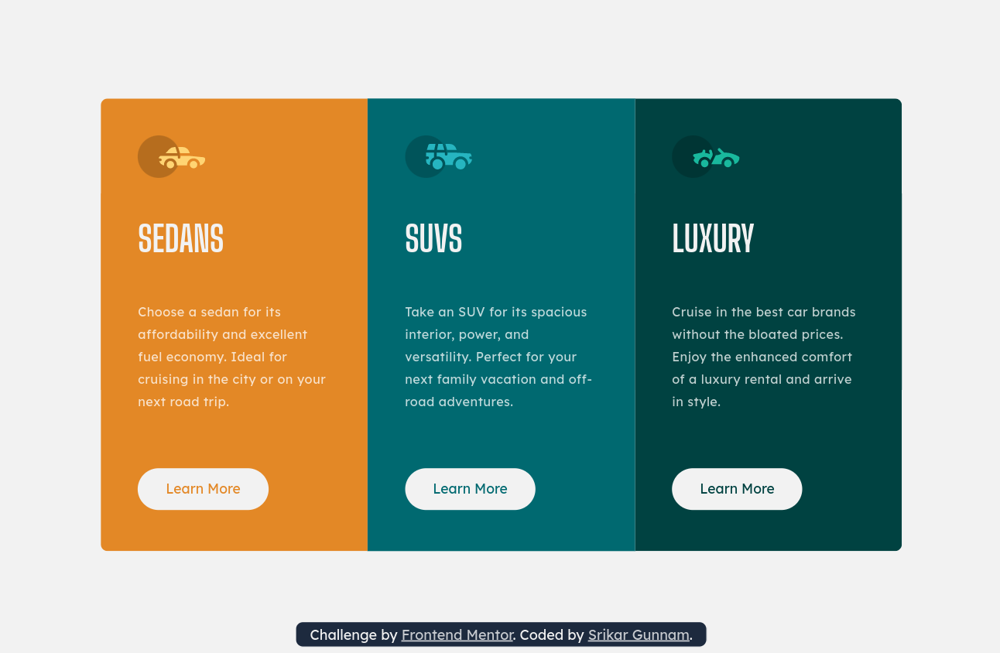

# Frontend Mentor - 3-column preview card component solution

This is a solution to the [3-column preview card component challenge on Frontend Mentor](https://www.frontendmentor.io/challenges/3column-preview-card-component-pH92eAR2-). Frontend Mentor challenges help you improve your coding skills by building realistic projects. 

## Table of contents

  - [Overview](#overview)
    - [The challenge](#the-challenge)
    - [Screenshots](#screenshots)
    - [Links](#links)
  - [My process](#my-process)
    - [Built with](#built-with)
    - [What I learned](#what-i-learned)
    - [Continued development 💪](#continued-development-)
    - [Useful resources 📚	🗃](#useful-resources-)
  - [Author 👦](#author-)
    - [Srikar Gunnam](#srikar-gunnam)
  - [Acknowledgments](#acknowledgments)

## Overview

### The challenge

Users should be able to:

- View the optimal layout depending on their device's screen size

### Screenshots

#### Mobile Preview
    

#### Desktop Preview

### Links 🔗

- [Solution URL](https://github.com/srikargunnam/frontendmentor-3-column-preview)
- [Live Site URL](https://srikargunnam.github.io/frontendmentor-3-column-preview/)

## My process 📜

### Built with 🏗

- Semantic HTML5 markup
- CSS Grid
- Sass: Syntactically Awesome Style Sheets
- Mobile-first workflow

### What I learned 📖

I used Sass for the first time, when i saw people using sass, I thought it requires some special efforts to learn, but real picture was different, it was easy and as I already knew CSS it was even more easy to understand the syntax, I loved the nexting in Sass, it wraps related things at one place, which is really a good thing, even @mixin and @include are notable features in Sass, the @extend directive is also good but i didn't use it in this project, @import directives were not new to me.

### Continued development 💪

I would like to use Sass to the fullest in my upcoming projects. Along with that i would like to look at some other interesting CSS framewroks like _stylus_ & _tailwind CSS_.

### Useful resources 📚	🗃

- [w3schools](https://www.w3schools.com/sass/sass_intro.php) - This will come in handy whenever I stuck, they have a good _try it yourself_ option, which will help in playing with the code instantly to check how it works, particularly for this project I used this resource to get a decent understanding of Sass.
- [MDN Web Docs](https://developer.mozilla.org/en-US/docs/Web) - I always mention this as a useful resource, as it is the best place to get the complete understanding of html, css & javascript, they have a search bar which is really cool in getting the right resource without wasting time.

## Author 👦

### Srikar Gunnam

- Website - [srikargunnam.com](https://srikargunnam.com) 	🕸
- Frontend Mentor - [@srikargunnam](https://www.frontendmentor.io/profile/srikargunnam)
- Twitter - [@SrikarGunnam](https://twitter.com/SrikarGunnam)
- Codepen - [@srikargunnam](https://codepen.io/srikargunnam)
- GitHub - [@srikargunnam](https://github.com/srikargunnam/)

## Acknowledgments

I would like to thank [Dev Ed](https://www.youtube.com/c/DevEd) for making a short & simple YouTube video [Learn Sass in 20 Minutes](https://www.youtube.com/watch?v=Zz6eOVaaelI), the vs code extension which he showed in his video worked out for me to step into Sass.
